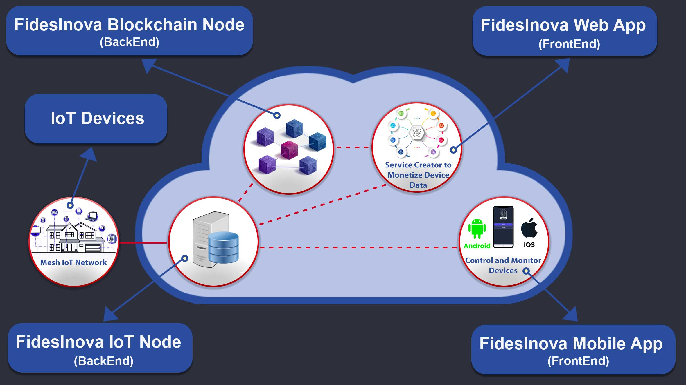

# Introduction

#### Revolutionizing Decentralized IoT Systems
Fides Innova is dedicated to transforming the landscape of decentralized and reliable IoT systems. Our platform, underpinned by cutting-edge blockchain technology, focuses on zk-IoT devices to ensure seamless, secure communication, and a network founded on trust and transparency.
<figure><figcaption></figcaption></figure>
<figure><figcaption></figcaption></figure>

#### Key Features

* **FidesInnova Blockchain Node**: Our robust blockchain node, equipped with ZKP-enabled JavaScript execution, ensures the secure and authentic execution of Service Contracts, providing a solid foundation for our ecosystem.
* **FidesInnova IoT Node**: Designed for efficiency and reliability, the IoT Node integrates seamlessly with our blockchain technology, enhancing the functionality and security of IoT devices across the network.
* **FidesInnova Web App**: This intuitive web application allows users to create, manage, and monetize Service Contracts effortlessly. It serves as a powerful tool for extending the capabilities of IoT devices and managing your decentralized services.
* **FidesInnova Mobile App**: Available on major app stores, our mobile app offers users unparalleled control over their IoT devices, bringing convenience and functionality to your fingertips.

#### Empowering Users and Expanding Possibilities

FidesInnova is more than just a platform; it's a holistic ecosystem that empowers users through its suite of applications and services. Explore our ecosystem, engage with our technologies, and experience a new standard in decentralized IoT solutions.

Join us on this journey towards a more transparent, secure, and innovative future.
