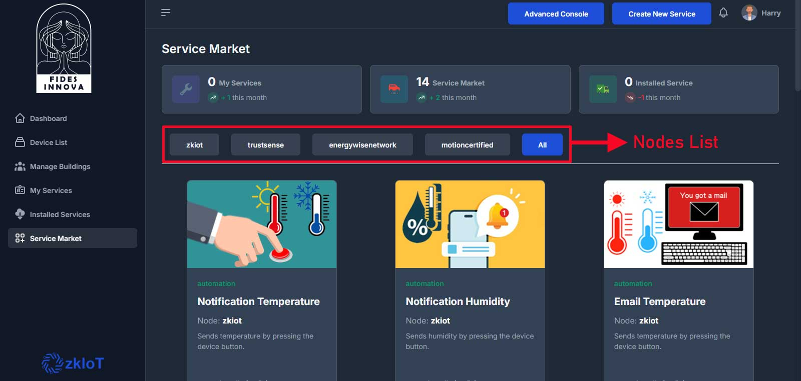

# Publishing Service Contracts on the Fides Innova Blockchain

In this section, you'll learn how to publish service contracts on the FidesInnova Blockchain. After creating a service contract on a node, users can submit a request for publication to the node admin. Once approved, the service is published on the FidesInnova Blockchain, making it accessible to all nodes within the network. This process ensures that services are securely shared and easily installed across the entire FidesInnova ecosystem, fostering collaboration and expanding the functionality of IoT devices.

#### Steps to Publish a Service Contract on FidesInnova Blockchain

1. **Create a Service Contract**:
   * Log in to the FidesInnova Web App.
   * Click the Create New Service button at the top of the pane to start a new service contract.
   * Use the graphical IDE to visually design and customize your service contract. This intuitive interface allows you to drag and drop elements, write JavaScript code, and configure settings according to your specific IoT requirements.
2. **Submit for Admin Approval**:
   * Once the service contract is ready, submit a request to the node admin for approval.
   * The submission will be reviewed by the node admin to ensure it meets the required standards and guidelines.
3. **Admin Review and Approval**:
   * The node admin reviews the submitted service contract.
   * If approved, the admin publishes the service contract on the FidesInnova Blockchain.
4. **Service Publication**:
   * After admin approval, the service contract is officially published on the FidesInnova Blockchain.
   * The published service is now visible and accessible to all nodes through the Service Market Section.
5. **Service Sharing Across Nodes**:
   * Other nodes within the FidesInnova ecosystem can now view and install the published service contract from the Service Market.
   * This enables seamless sharing and expansion of IoT functionalities across the entire network.

<figure><figcaption></figcaption></figure>

These steps ensure that service contracts are securely created, reviewed, and distributed across the decentralized FidesInnova ecosystem.
