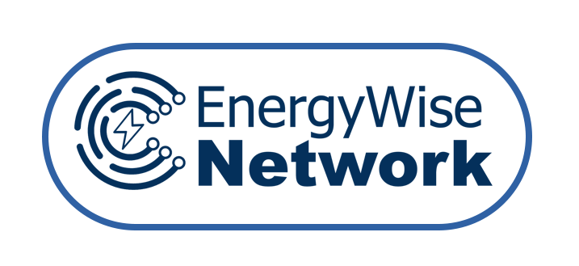
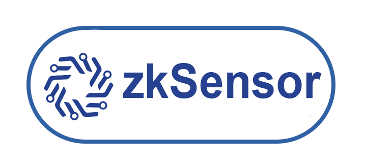

# Web App (User Panel, Admin Panel)

The FidesInnova Web App is a powerful and intuitive platform designed to give users comprehensive control over their IoT ecosystem. Serving as the central hub for service creation and data monetization, the FidesInnova Web App allows users to effortlessly manage their IoT devices and interact with the broader FidesInnova ecosystem.

With the FidesInnova Web App, users can create, customize, and deploy Service Contracts—JavaScript-based mini-programs that enable the automation and monetization of IoT data. The app provides access to the Service Market, where users can explore a wide range of pre-written contracts, enhancing the functionality of their IoT devices with just a few clicks.

The Web App’s user-friendly interface simplifies complex tasks, making it easy for users to harness the full potential of decentralized IoT solutions. Whether you’re managing a network of devices or seeking to monetize IoT data, the FidesInnova Web App offers the tools and flexibility you need to stay ahead in the rapidly evolving IoT landscape.

**To access the web app, you can use the panels from different nodes that utilize FidesInnova's open-source code for their business. Below are the names of some of these nodes. By visiting their websites, you can access their panel sections.**

<figure><figcaption>
<a href="https://energywisenetwork.com">energywisenetwork.com</a>
</figcaption></figure> <figure><figcaption>
<a href="https://motioncertified.online">motioncertified.online</a>
</figcaption></figure> <figure><figcaption>
<a href="https://trustsense.tech/">trustsense.tech</a>
</figcaption></figure> <figure><figcaption>
<a href="https://zksensor.tech/">zksensor.tech</a>
</figcaption></figure>

