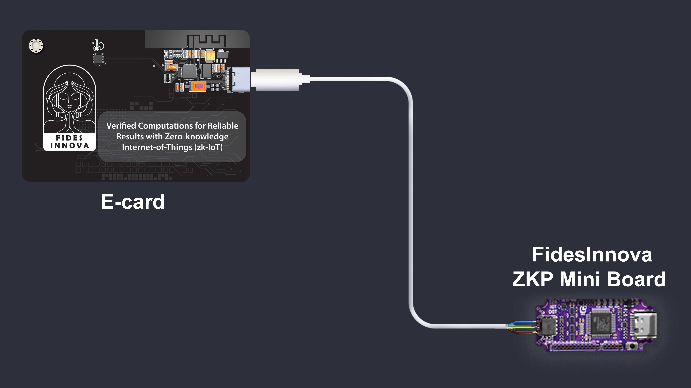
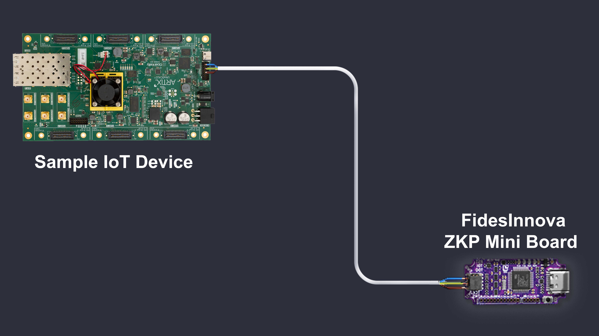

# ZKP and IoT Device Firmware Integration (zk-Device Design)

## Solution 1: C++ Library 

The FidesInnova C++ Library offers a proof generation function specifically designed for IoT firmware developers. This function can be seamlessly integrated into IoT firmware to generate proofs whenever necessary.

<figure><figcaption></figcaption></figure>

The IoT developer should insert their program file into the FidesInnova Commitment Generator. This tool creates a new file to be compiled and uploaded to the IoT devices and a Commitment to be uploaded to the blockchain.

#### Hardware implementation of C++ library using ESP32-C6:

* Microcontroller: ESP32-C6
* Processor Architecture: RV32IMAC
* Program storage space: 400KB
* Dynamic memory: 20KB
* Clock Speed: 160MHz

#### Average result time:

* Commitment generation time in C++: 0.5\~1 sec
* ZKP generation time in C++: 0.5\~1.5 sec
* Verification time in C++: 0.5\~1 sec

#### To integrate with new hardware, we need the following information:

* Microcontroller
* Processor Architecture
* Clock Speed (MHz)
* RAM (SRAM) Size
* Flash Memory
* Hardware Cryptographic Support
* Random Number Generation (RNG)
* Hardware Cryptographic Support
* Cryptography Libraries

#### GitHub

[https://github.com/FidesInnova/zk\_iot\_c](https://github.com/FidesInnova/zk_iot_c)

To access the GitHub, please email info@fidesinnova.io

## Solution 2: Rust Crates

Similar to the C++ library, FidesInnova's Rust Crates offer a proof generation function for Rust programs. This functionality allows developers to seamlessly integrate proof generation into their Rust applications, ensuring robust and secure performance.

#### GitHub

[https://github.com/FidesInnova/zk\_iot\_rust](https://github.com/FidesInnova/zk_iot_rust)

To access the GitHub, please email info@fidesinnova.io

## Solution 3: FidesInnova ZKP Mini Board

<figure><figcaption></figcaption></figure>

Using a JTAG connection, the ZKP Mini Board connects to the IoT board and extracts the register values of the device's processor during firmware execution. This process enables real-time monitoring and verification of firmware behavior.

<figure><figcaption></figcaption></figure>

The extracted register values are used to generate zero-knowledge proofs (ZKPs), providing verifiable evidence of the firmware's integrity without disclosing sensitive information. These ZKPs are then made available for the IoT device to use.
